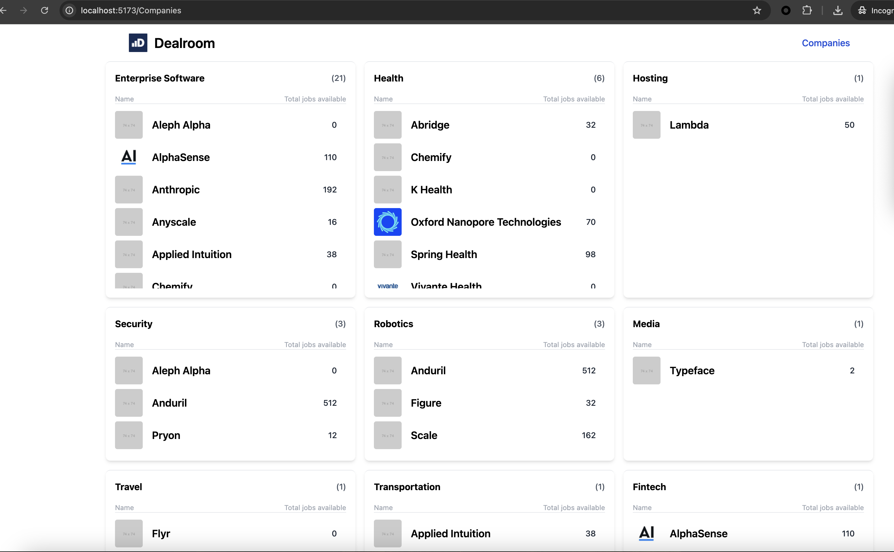

# Dealroom Frontend

## Overview

This is the frontend part of the Dealroom fullstack task. It is built using React, TypeScript, Vite, and TailwindCSS.

## Getting Started

### Installation

1. Clone the repository:
    ```sh
    git clone
    cd dealroom-frontend
    ```

2. Install the dependencies:
    ```sh
    npm install
    ```

### Scripts

- **Development:**
    ```sh
    npm run dev
    ```
    Runs the app in the development mode.

- **Build:**
    ```sh
    npm run build
    ```
    Builds the app for production to the `dist` folder.

- **Preview:**
    ```sh
    npm run preview
    ```
    Serves the production build locally.

- **Type Checking:**
    ```sh
    npm run type-check
    ```
    Runs TypeScript type checks.

- **Linting:**
    ```sh
    npm run lint
    ```
    Lints the codebase using ESLint.

- **Prettier:**
    ```sh
    npm run prettier
    ```
    Formats the codebase using Prettier.

